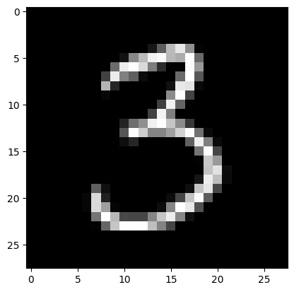
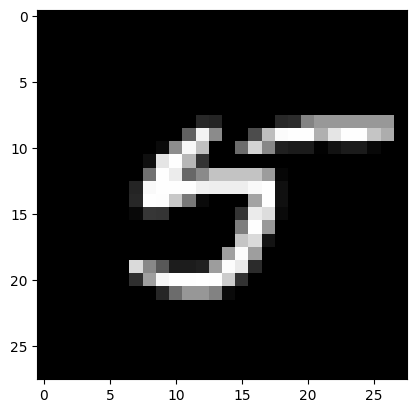
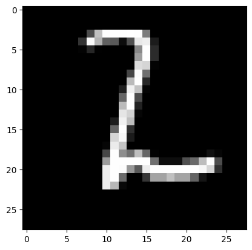

# Pytorch-Digit-Classifier
MNIST dataset conatains images of handwritten digits. This repository contains model created using pytorch to classify digits.

## Loading and Pre-processing Data
The MNIST dataset consists of grayscale images of digits from 0 to 9.

The dataset is loaded using PyTorch's MNIST class. https://pytorch.org/vision/0.15/generated/torchvision.datasets.MNIST.html#torchvision.datasets.MNIST

While loading data we apply transforms.

1. convert images to tensor
2. Normalize dataset with mean=0.1307 and standar deviation=0.3081
Normalization helps to get pixel values to optimal range and better comparison of values.

Data is loaded into training set and testing set differently with batch size of 64. Getting data in batches makes training faster.

## Model Training
A convolution model is created to clasiify images into 10 different digits.
While the input dimensions are 28x28, output is of 10 different classes.
The model is trained using CrossEntropyLoss as criterion and Stochastic Gradient Descent optimizer.

The final model reaches 96.5% test accuracy with 1 hidden layer using tanh activation in 15 epochs.

